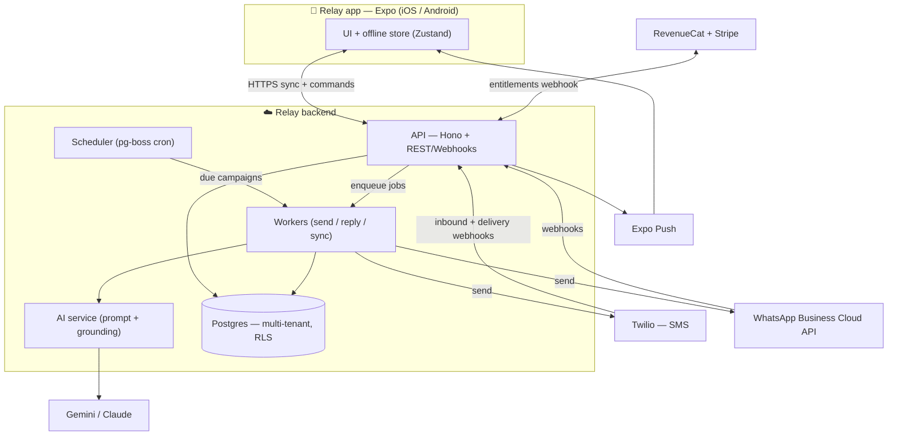
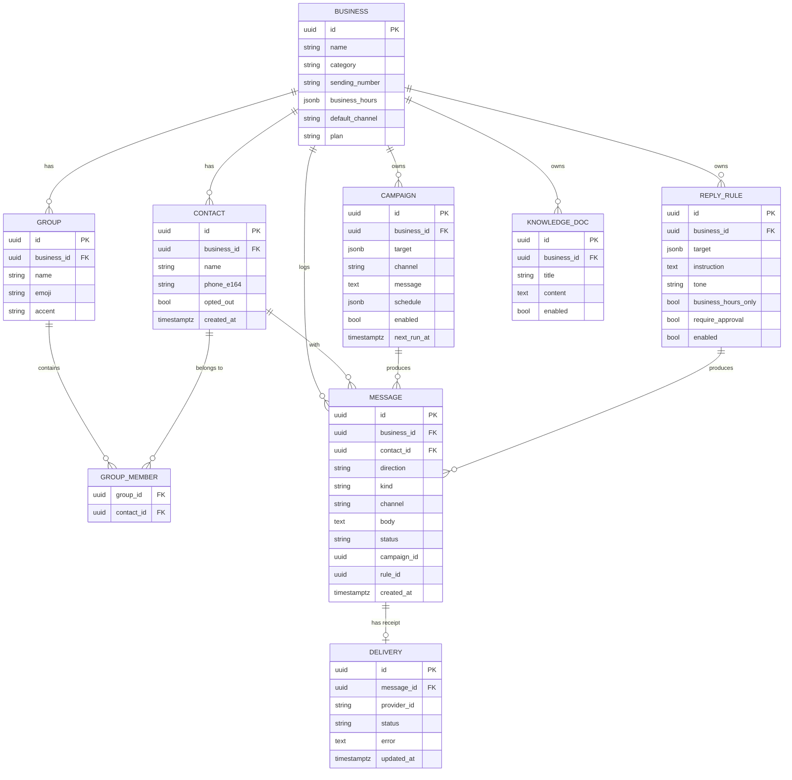
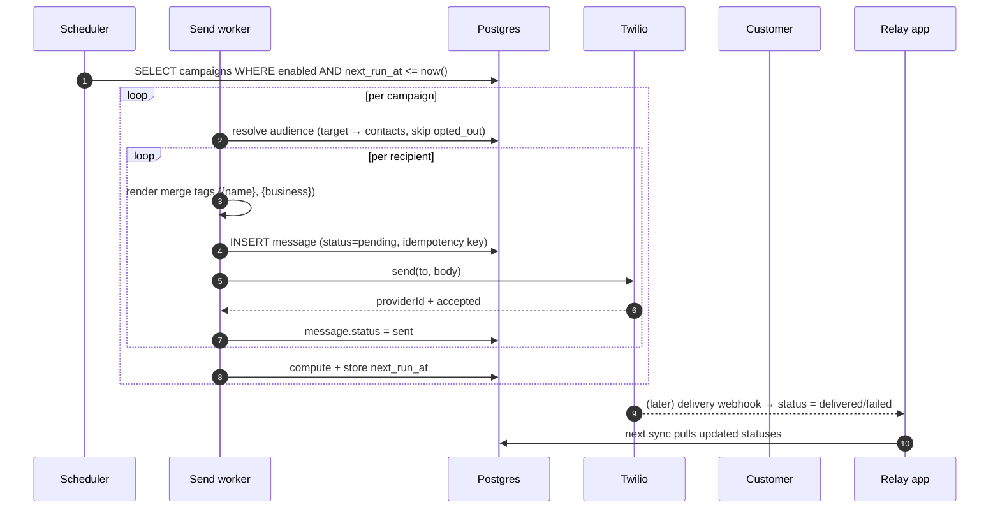
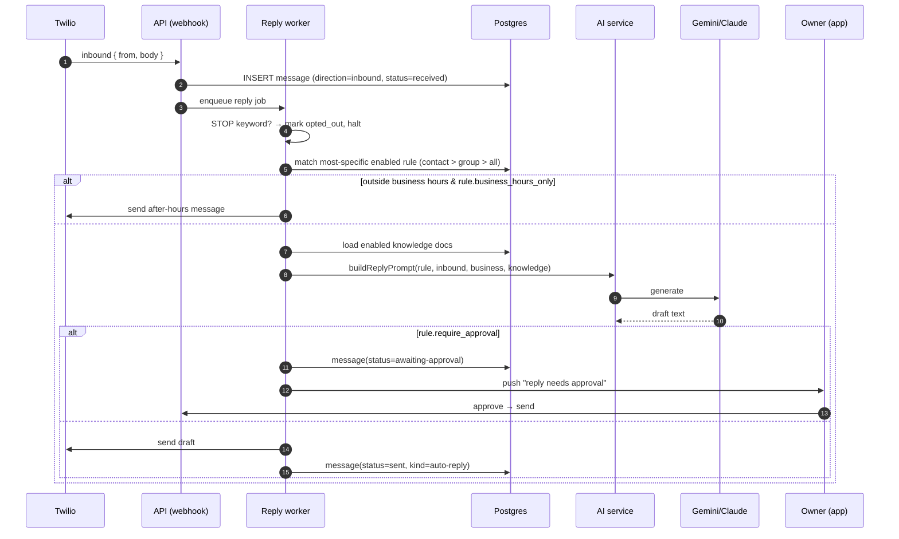
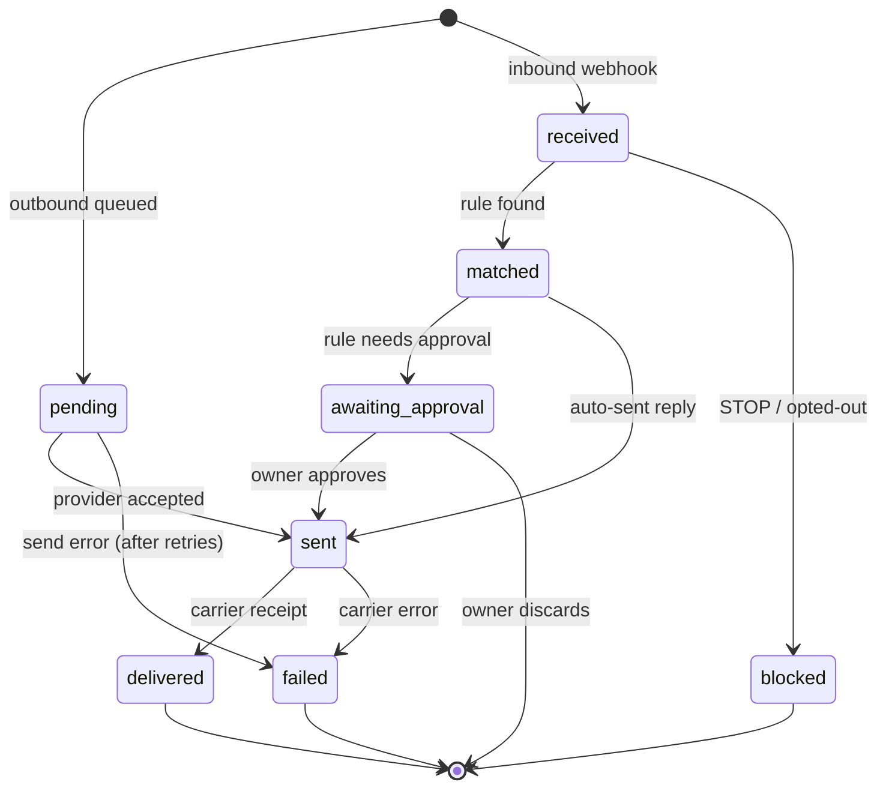
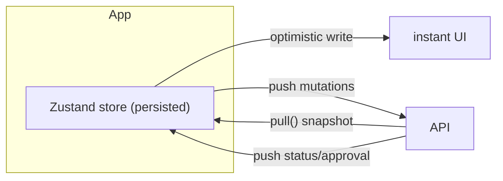
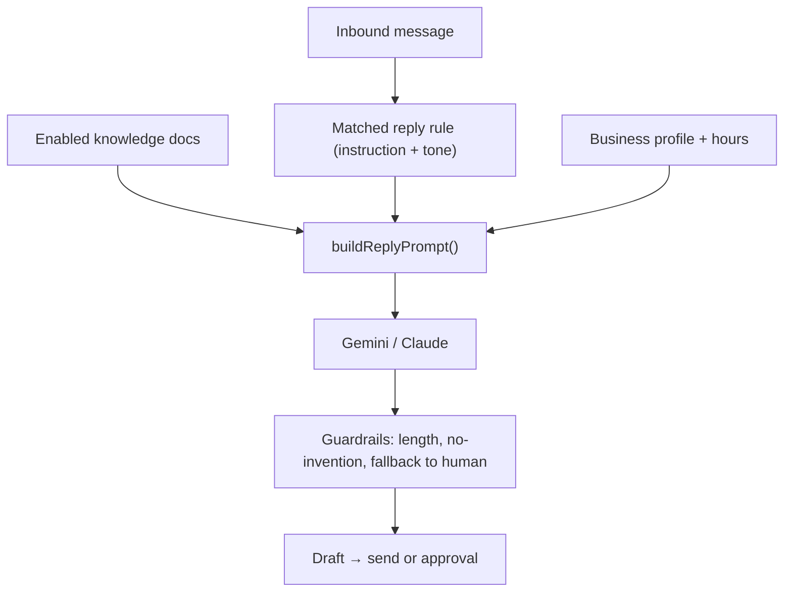
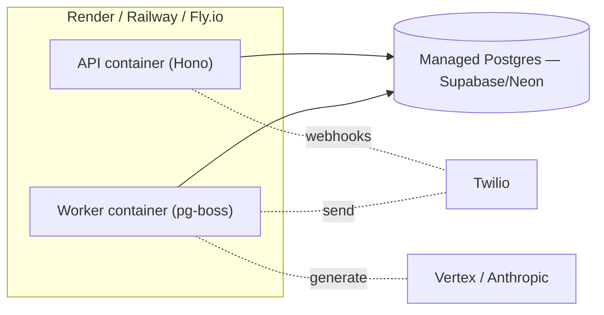

# Relay — Data Pipeline & Architecture Showcase

> A complete, end-to-end view of how data moves through Relay: from a scheduled
> trigger or an inbound customer text, through processing and AI, to a delivered
> message — and back to your phone. This is the blueprint the backend is built
> against.
>
> _Diagrams render automatically on GitHub._

## Contents
1. [North star](#1-north-star)
2. [System context](#2-system-context)
3. [The data model](#3-the-data-model)
4. [Pipeline A — Auto-send (outbound)](#4-pipeline-a--auto-send-outbound)
5. [Pipeline B — AI auto-reply (inbound)](#5-pipeline-b--ai-auto-reply-inbound)
6. [Message lifecycle](#6-message-lifecycle)
7. [Scheduling & reliability](#7-scheduling--reliability)
8. [Client sync (offline-first)](#8-client-sync-offline-first)
9. [The AI subsystem](#9-the-ai-subsystem)
10. [Compliance & security](#10-compliance--security)
11. [Tech stack & deployment](#11-tech-stack--deployment)
12. [Implementation plan](#12-implementation-plan)
13. [What I need from you](#13-what-i-need-from-you)

---

## 1. North star

Four principles drive every decision below:

- **Server-authoritative.** Because Apple forbids on-device SMS automation, the
  backend owns sending, receiving, scheduling and AI. The app is a client.
- **Event-driven.** Everything is a reaction to one of two triggers: a **clock**
  (a campaign is due) or an **inbound message** (a customer replied). Each flows
  through a pipeline and lands as a row in the `messages` log.
- **Offline-first client.** The app stays instant by reading/writing a local
  store, then syncing. The server is the source of truth.
- **One log to rule them all.** Every send, receipt and AI reply becomes a
  `messages` row with a status — that single timeline powers the Activity tab,
  analytics, and billing.

---

## 2. System context



**Who does what**

| Component | Responsibility |
|---|---|
| **App** | Render UI, capture edits, optimistic local writes, sync |
| **API** | Auth, sync, command endpoints, provider + billing webhooks |
| **Scheduler** | Fire due campaigns to the minute; enqueue send jobs |
| **Workers** | Resolve audience, render messages, call providers, run AI |
| **AI service** | Assemble grounded prompts, call the model, enforce guardrails |
| **Postgres** | Single source of truth; per-tenant isolation via RLS |

---

## 3. The data model



This mirrors the client types in [`src/data/types.ts`](../src/data/types.ts) — the
app and server speak the same shapes, so sync is a near-1:1 mapping.

---

## 4. Pipeline A — Auto-send (outbound)

**Trigger:** the clock. A campaign's `next_run_at` arrives.



**Data written at each stage:** a `messages` row per recipient (so Activity shows
exactly who got what), then a `deliveries` row when the carrier confirms. The
idempotency key (`campaign_id + contact_id + scheduled_slot`) guarantees a
retrying worker never double-texts a customer.

---

## 5. Pipeline B — AI auto-reply (inbound)

**Trigger:** a customer texts your number. Twilio posts an inbound webhook.



The prompt assembly is already implemented and shared with the client in
[`src/services/ai.ts`](../src/services/ai.ts) (`buildReplyPrompt`) — the server
imports the same function so behavior is identical to the in-app preview.

---

## 6. Message lifecycle

Every message — sent or received — moves through one state machine. This is the
backbone of Activity, retries and analytics.



---

## 7. Scheduling & reliability

- **Next-run computation.** A campaign's `schedule` (once / daily / weekly /
  monthly + time) yields `next_run_at`. The scheduler polls every minute for due
  rows — no drift, survives restarts (state lives in Postgres).
- **Queue.** `pg-boss` runs jobs **on Postgres** (no extra Redis). Jobs:
  `send.message`, `reply.generate`, `sync.fanout`.
- **Idempotency.** Every send carries a deterministic key; replays are no-ops.
- **Retries & DLQ.** Transient provider/network errors retry with backoff;
  permanent errors (invalid number, opt-out) fail fast to a dead-letter table for
  visibility — never silently dropped.
- **Exactly-once-ish.** Idempotency + transactional status writes mean a customer
  is messaged once even if a worker crashes mid-batch.

---

## 8. Client sync (offline-first)



The app never blocks on the network: edits apply locally first, then reconcile
via [`RelayApi`](../src/services/api.ts) (`pull` + mutations). Server-driven
changes (delivery receipts, AI drafts) arrive on the next pull or via push.
Realtime (WebSocket/SSE) is an optional later upgrade for the Activity feed.

---

## 9. The AI subsystem



- **Grounding.** Enabled `knowledge_docs` are injected as authoritative
  "Background"; the model is instructed never to invent facts.
- **Control.** Per-rule tone + optional human approval; per-business after-hours
  behavior.
- **Cost & safety.** Short max-output (SMS-sized), per-tenant rate limits, and a
  daily AI budget cap. Model is swappable (Vertex Gemini or Anthropic Claude)
  behind the AI service.

---

## 10. Compliance & security

| Area | Approach |
|---|---|
| **Opt-out** | STOP/UNSUBSCRIBE auto-detected (`isOptOut`); contact flagged, never messaged again |
| **A2P 10DLC** | US SMS requires brand + campaign registration via Twilio before scaling |
| **Consent & quiet hours** | Only message opted-in contacts; respect business hours / local time |
| **Tenant isolation** | Postgres Row-Level Security keyed by `business_id`; every query scoped |
| **Secrets** | Provider/model keys live only on the server (env / secret manager), never in the app |
| **PII** | Phone numbers + message bodies encrypted at rest; least-privilege access; audit log |
| **WhatsApp** | Approved templates required outside the 24-hour customer window |

---

## 11. Tech stack & deployment



| Concern | Choice | Why |
|---|---|---|
| Language | TypeScript (Node 22) | Shares types with the app |
| HTTP | **Hono** | Tiny, fast, edge-friendly |
| ORM | **Drizzle** | Type-safe SQL, easy migrations |
| DB | **Postgres** (Supabase/Neon) | Relational + RLS |
| Queue/cron | **pg-boss** | Runs on Postgres — no Redis |
| SMS | **Twilio** | Reliable, great webhooks |
| AI | Vertex **Gemini** / **Claude** | Swappable behind AI service |
| Billing | **RevenueCat** + Stripe | Mobile IAP + web |
| Auth | Supabase Auth / Clerk | Email + OAuth, multi-tenant |

Monorepo layout (added next):

```
relay/
  app/  src/        # the mobile app (done)
  server/           # NEW backend
    src/
      index.ts       # Hono app + routes
      db/            # Drizzle schema + migrations
      routes/        # sync, commands, webhooks
      workers/       # send, reply, scheduler
      services/      # twilio, ai, billing adapters
      lib/           # auth, tenancy, env
    package.json
    drizzle.config.ts
```

---

## 12. Implementation plan

Phased so each step is shippable and testable on its own. ✅ = done, 🔜 = next.

| Phase | Deliverable | Status |
|---|---|---|
| **0** | `server/` scaffold: Hono app, env, health, Docker, Drizzle config | ✅ |
| **1** | DB schema (mirrors `types.ts`) + migrations + tenant middleware | ✅ |
| **2** | Sync API: `GET /v1/sync`, upsert endpoints; client `RelayApi` wired | ✅ |
| **3** | Send adapter (Twilio/mock) + `POST /v1/send` + delivery webhooks | ✅ mock |
| **4** | Scheduler: due campaigns → audience → merge → idempotent send | ✅ mock |
| **5** | Inbound → opt-out → rule match → `buildReplyPrompt` → AI → approve/send | ✅ mock |
| **6** | Billing webhook (RevenueCat) + Pro gating | |
| **7** | WhatsApp adapter (second channel) | |
| **8** | Deploy (Render/Railway) + logging/metrics | |

Phases **0–5 are built and verified end-to-end** against local Postgres with mock
adapters (`npm run db:migrate && db:seed && dev`, then the dev endpoints in
[`server/README.md`](../server/README.md)). Each flips to live by setting the
matching credentials — feature flags in `server/src/lib/env.ts` switch
mock↔live with no code change. Phases 6–8 remain.

---

## 13. What I need from you

To take it from "runs locally with mocks" to "really sends texts":

- **Twilio**: Account SID, Auth Token, and a phone number (I'll wire it behind
  env vars; sending stays mocked until these exist). US volume also needs **A2P
  10DLC** brand/campaign registration.
- **Database**: a Postgres URL (free Supabase/Neon is perfect) — or I'll run one
  locally via Docker for development.
- **AI**: a Vertex AI (Gemini) service account **or** an Anthropic API key.
- **Billing** (later): RevenueCat project keys.
- **Deploy target** (later): Render, Railway or Fly.io.

Nothing here blocks Phases 0–2 — I'll build against mock adapters and swap in
real credentials when you have them.
