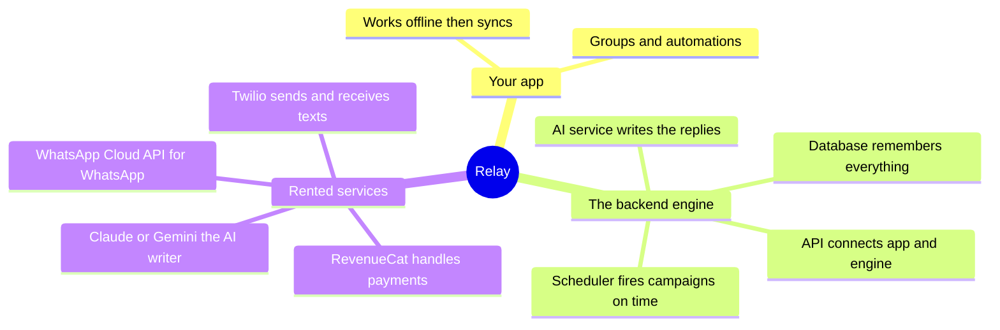
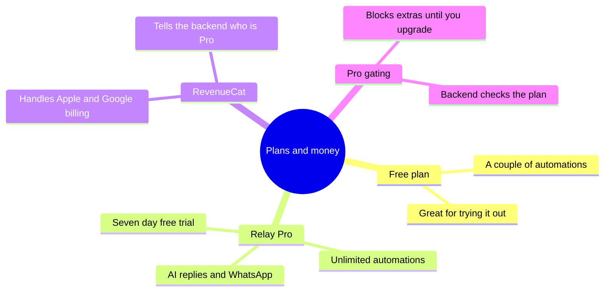
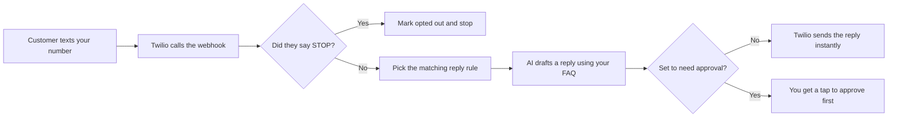
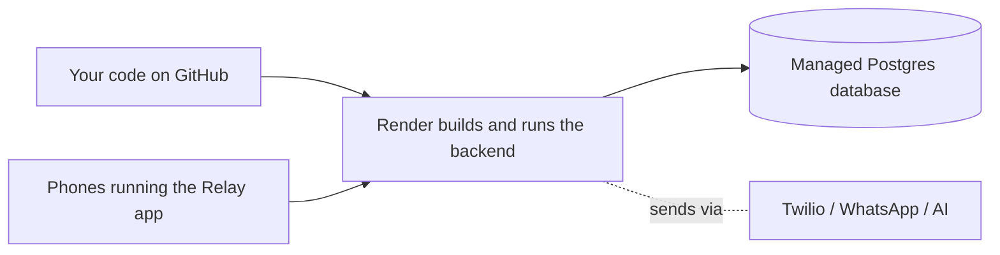

# Relay, explained

A plain-English tour of how Relay works and what every outside service (Twilio,
WhatsApp, the AI, RevenueCat) actually *is* — no jargon left undefined. The
diagrams and mind maps render automatically on GitHub.

## Contents
1. [The 30-second version](#1-the-30-second-version)
2. [The whole system, as a mind map](#2-the-whole-system-as-a-mind-map)
3. [Every piece, in plain English](#3-every-piece-in-plain-english)
4. [The money side, as a mind map](#4-the-money-side-as-a-mind-map)
5. [Follow one message, start to finish](#5-follow-one-message-start-to-finish)
6. [What you need to switch it on](#6-what-you-need-to-switch-it-on)
7. [How it gets deployed](#7-how-it-gets-deployed)
8. [Glossary](#8-glossary)

---

## 1. The 30-second version

Relay is two things: an **app** (on your phone) and a **backend** (a program
running on a computer in the cloud).

- The **app** is the *remote control* — you tap buttons to set up groups and
  automations.
- The **backend** is the *engine* — it actually sends the texts, writes the
  replies, and remembers everything, 24/7, even when your phone is off.

The engine doesn't build everything from scratch. It **rents specialist
companies** for the hard parts: one to deliver text messages, one to write
replies with AI, one to handle subscription payments. You pay them small fees
instead of reinventing phone networks and payment systems.

That's the whole idea. The rest of this doc explains each renter.

---

## 2. The whole system, as a mind map

---

## 3. Every piece, in plain English

### The app
**What it is:** the Relay phone app (built with React Native / Expo).
**Analogy:** a TV remote. It shows you everything and lets you press buttons,
but it isn't the thing doing the work.
**Why Relay needs it:** it's how you (the business owner) set things up and see
what happened. It keeps a local copy so it's always instant, even with bad signal.

### The backend (a.k.a. the server, the engine, "the cloud")
**What it is:** a small program running on a rented computer, always on.
**Analogy:** the kitchen behind a restaurant. You never see it, but it's where
the cooking happens.
**Why Relay needs it:** Apple won't let a phone app send texts in the
background. So the *engine* sends and receives on your behalf — which is also
why Relay works the same on iPhone and Android.

### The database (Postgres)
**What it is:** the place all your data is stored — contacts, groups, messages.
**Analogy:** a giant, super-organized filing cabinet that never forgets.
**Why Relay needs it:** so your customers, groups and message history survive
forever and can be looked up instantly.

### The API
**What it is:** the set of "doors" the app uses to talk to the backend.
**Analogy:** a waiter. The app (you at the table) asks the waiter for things;
the waiter goes to the kitchen (backend) and brings back the result.
**Why Relay needs it:** it's the agreed-upon way the app and engine talk.

### Webhooks
**What it is:** the backend's phone number that *outside services call* when
something happens.
**Analogy:** instead of you calling the pizza place every 2 minutes asking "is
it ready?", they call *you* the moment it's done. A webhook is them calling you.
**Why Relay needs it:** the instant a customer texts back, or a message is
delivered, Twilio "calls" Relay's webhook so it can react immediately.

### Twilio  📲
**What it is:** a company that owns phone numbers and actually sends/receives
SMS text messages over the real phone network.
**Analogy:** the post office. You hand them a letter (message) and an address
(phone number); they deliver it and tell you if it arrived.
**Why Relay needs it:** phone apps can't blast texts themselves. Relay hands
Twilio the message + number, and Twilio does the delivering. You get a dedicated
business number so texts come from *your business*, not your personal phone.
**Rough cost:** pennies per text + ~$1–2/month for the number.

### A2P 10DLC
**What it is:** a one-time registration (through Twilio) that tells US phone
carriers "this is a real business sending wanted messages."
**Analogy:** a business license for texting. It proves you're not a spammer.
**Why Relay needs it:** US carriers now require it before a business can text
customers at any volume. Skipping it gets messages blocked.

### WhatsApp Business Cloud API
**What it is:** the same idea as Twilio, but for **WhatsApp** messages —
provided by Meta (Facebook).
**Analogy:** a second post office that only delivers to WhatsApp.
**Why Relay needs it:** lots of customers (especially internationally) prefer
WhatsApp. Relay treats it as just another "channel," so the same groups and
automations work there too. *(This is a Pro feature.)*

### The AI model (Claude or Gemini)
**What it is:** a large language model — the part that actually *writes* the
replies.
**Analogy:** a really good assistant who drafts texts in your voice. You give
them your instructions ("answer booking questions, be friendly") plus your facts
(hours, prices), and they write the reply.
**Why Relay needs it:** so customer questions get answered instantly, 24/7,
grounded in *your* information — never made up.
**Rough cost:** a fraction of a cent per reply.

### RevenueCat
**What it is:** a service that handles **subscriptions and payments** inside the
app.
**Analogy:** the cashier + bookkeeper for your "Pro" plan. It deals with Apple's
and Google's complicated payment systems, free trials, renewals and refunds, and
keeps a tidy record of who's currently paying.
**Why Relay needs it:** Apple and Google *require* you to use their in-app
payment systems for subscriptions, and they're fiddly. RevenueCat wraps all that
and simply tells Relay "this user is Pro" (or not).
**Rough cost:** free until you're making real money, then a small % .

### Pro gating (entitlements)
**What it is:** the rule that **free users get the basics, paying "Pro" users
get more** (unlimited automations, WhatsApp, etc.).
**Analogy:** a velvet rope at a club. "Gating" = the bouncer checking your
wristband before letting you do a premium action.
**Why Relay needs it:** it's how the app makes money — give away enough to be
useful, charge for power features. Relay's backend checks the rope: if a free
user tries to create too many automations, it politely says "upgrade to Pro."

### The scheduler
**What it is:** the part of the engine that **fires campaigns at the right
time** and retries anything that fails.
**Analogy:** an alarm clock attached to a to-do list. Every minute it checks
"anything due now?" and does it.
**Why Relay needs it:** so "every Friday at 9am, text the VIPs" actually happens
on its own, reliably, without you lifting a finger.

### Offline-first & sync
**What it is:** the app keeps its own copy of your data so it's instant, then
quietly **syncs** with the backend.
**Analogy:** working on a document on your laptop on a plane — it saves locally,
then uploads when you land.
**Why Relay needs it:** the app never freezes waiting for the internet, and the
backend stays the single source of truth.

---

## 4. The money side, as a mind map

**How an upgrade actually flows:** you tap *Upgrade* → Apple/Google take the
payment → RevenueCat confirms it → RevenueCat "calls" Relay's webhook → the
backend marks your business **Pro** → the velvet rope opens.

---

## 5. Follow one message, start to finish

### Journey A — a scheduled promo goes out

### Journey B — a customer texts and the AI replies

Every one of these becomes a row in your **Activity** tab, with a status.

---

## 6. What you need to switch it on

Right now everything runs in a **demo mode** with stand-ins ("mocks"), so the
whole thing works without any accounts. To make it send *real* messages, you
sign up for these and paste in the keys — no code changes, just settings:

| You sign up for | Gives Relay | Needed for | Rough cost to start |
|---|---|---|---|
| **Twilio** + a number (+ A2P 10DLC) | Real SMS sending/receiving | Texting customers | ~$1–2/mo + pennies/text |
| **Anthropic (Claude)** or Google **Gemini** key | The AI writer | Auto-replies | cents; pay-as-you-go |
| **Postgres host** (Supabase / Neon) | The cloud database | Storing data | free tier to start |
| **Render** (or Railway / Fly) | A place to run the backend | Being online 24/7 | free tier to start |
| **RevenueCat** + App Store / Play | Subscriptions | Charging for Pro | free until you earn |

You can turn these on **one at a time** — e.g. just Twilio first to send real
texts, add AI later. The backend flips each from mock to live the moment its key
is present.

---

## 7. How it gets deployed

"Deploy" just means *putting the backend on an always-on computer so it has a
public address.*

The repo includes a `render.yaml` blueprint: point Render at the repo and it
creates the backend **and** a database, runs the migrations, and gives you a URL.
There's also a `Dockerfile` if you prefer Railway, Fly.io, or your own server.

---

## 8. Glossary

- **API** — the agreed "doors" the app uses to talk to the backend (the waiter).
- **Backend / server** — the always-on program that does the real work (the kitchen).
- **Channel** — a way to deliver a message: SMS or WhatsApp.
- **Deploy** — putting the backend on a public, always-on computer.
- **Entitlement** — a thing a paying user is allowed to do (e.g. "Pro").
- **Idempotent** — safe to repeat: running it twice won't double-send.
- **Migration** — a versioned change to the database's structure.
- **Mock** — a stand-in used in demo mode so things work without real accounts.
- **Postgres** — the database (the filing cabinet).
- **Pro gating** — checking a user's plan before allowing a premium action.
- **RevenueCat** — handles subscriptions across Apple/Google (the cashier).
- **Scheduler** — fires campaigns at the right time (the alarm clock).
- **Sync** — the app and backend reconciling their copies of the data.
- **Twilio** — sends/receives real SMS (the post office).
- **Webhook** — an outside service calling *your* backend when something happens.
- **A2P 10DLC** — US registration proving you're a legit business texter.

---

_See also: [DATA-PIPELINE.md](DATA-PIPELINE.md) for the technical deep-dive with
sequence diagrams, and [ARCHITECTURE.md](ARCHITECTURE.md) for the component map._
